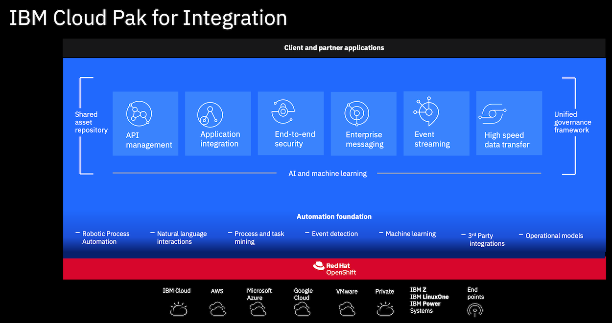

# Enterprise-grade integration with Cloud Pak for Integration

In this workshop we'll be looking at various parts of the Cloud Pak for Integration platform. The goals of this workshop are:

- Create, deploy and test a new API using the API Connect Developer Toolkit
- Using App Connect to bidirectionally sync Salesforce data with an application
- Using IBM Event Streams for near realtime data replication

## About Cloud Pak for Integration

IBM Cloud Pak for Integration is an enterprise-ready, containerized software solution that contains all the tools you need to integrate and connect application components and data both within and between clouds. Running on Red Hat OpenShift, the IBM Cloud Pak for Integration gives businesses complete choice and agility to deploy workloads on premises and on private and public cloud.

Cloud Pak for Integration includes components to enable you to manage:

|   |   |
| - | - |
| **API lifecycle** | Create, secure, manage, share and monetize APIs across clouds while you maintain continuous availability. Take control of your API ecosystem and drive digital business with a robust API strategy that can meet the changing needs of your users |
| **Application and data integration** | Integrate all of your business data and applications more quickly and easily across any cloud, from the simplest SaaS application to the most complex systems - without worrying about mismatched sources, formats or standards |
| **Enterprise messaging** | Simplify, accelerate and facilitate the reliable exchange of data with a flexible and security-rich messaging solution that’s trusted by some of the world’s most successful enterprises. Ensure you receive the information you need, when you need it - and receive it only once |
| **Event streaming** | Use Apache Kafka to deliver messages more easily and reliably and to react to events in real time. Provide more personalized customer experiences by responding to events before the moment passes |
| **High-speed data transfer** | Send large files and data sets virtually anywhere, reliably and at maximum speed. Accelerate collaboration and meet the demands of complex global teams, without compromising performance or security |
| **Datapower Gateway** | Provides secure and reliable gateway services for API Connect |
| **Asset Repository** | Stores, manages, retrieves and enables search for integration assets |
| **Operations Dashboard** | Traces transactions across Cloud Pak for Integration |

## Steps

### Environment

This tutorial assumes that you have an instance of Cloud Pak for Integration with the components App Connect, API Connect, MQ, Event Streams. If you don't have this instance, you will first need to set an instance to execute hands-on instructions in this workshop.

This workshop consists of 3 labs as below. You can execute each of them in order or independently. Any dependent steps from previous excercises are called out and appropriate references provided for you to execute the steps.

### Lab 1: [Create, deploy and test a new API using the API Connect Developer Toolkit](./exercise-api-connect/README.md)

### Lab 2: [Sync Salesforce data using IBM App Connect Enterprise](./exercise-app-connect/README.md)

### Lab 3: [Using IBM MQ and IBM Event Streams for near realtime data replication](./exercise-event-streaming/README.md)

### [FAQs](./faq/README.md)